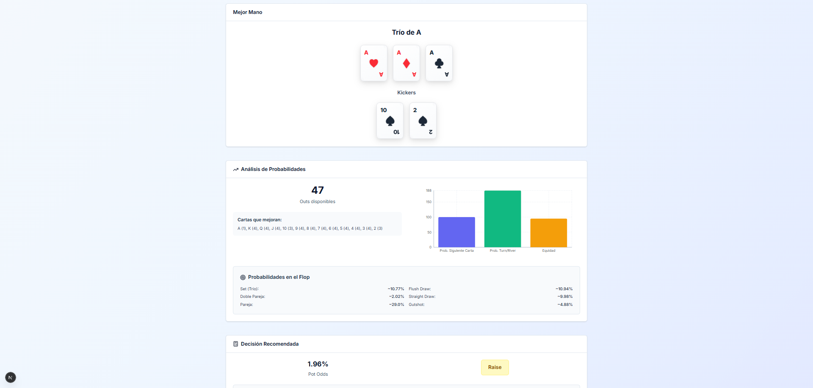

# ASeptar ♠

**ASeptar** es una aplicación web interactiva que funciona como asistente de póker Texas Hold'em, guiando al jugador **jugada por jugada** para tomar decisiones más acertadas con el respaldo de estadísticas, matemáticas y simulaciones avanzadas.

🌐 **Aplicación desplegada públicamente:** [Enlace](https://tu-enlace-a-la-app.com)

---

## 🚀 Descripción

ASeptar analiza tu mano, las cartas comunitarias, el bote y las apuestas para entregarte:

- **Evaluación de tu mejor jugada** (Call, Check, Raise o Fold).
- **Cálculo de probabilidades y outs** en cada etapa de la mano.
- **Estimación de la equity** mediante **simulación Monte Carlo**, corriendo miles de escenarios posibles para calcular la probabilidad real de victoria.
- **Cálculo de Pot Odds** y comparativa con tu equity para tomar decisiones óptimas.
- **Guía pre-flop** con análisis de fuerza de mano inicial y consejos.

Su objetivo es combinar **análisis matemático**, **probabilidad** y **diseño intuitivo** para ayudar a los jugadores a mejorar su estrategia.

---

## 🛠️ Tecnologías utilizadas

- **Frontend:** [Next.js](https://nextjs.org/) + [React](https://react.dev/)
- **Estilos:** [Tailwind CSS](https://tailwindcss.com/)
- **Iconos:** [Lucide Icons](https://lucide.dev/)
- **Gráficos:** [Recharts](https://recharts.org/)
- **Lenguaje:** TypeScript
- **Algoritmos:**
  - Evaluador de manos de póker hecho a medida.
  - **Simulación Monte Carlo** para cálculo de equity.
  - Lógica de Pot Odds y outs.
  - Clasificación de manos iniciales (pre-flop).

---

## ⚙️ Lógica de la aplicación

1. **Entrada de datos**  
   El usuario introduce sus cartas y las comunitarias, junto con valores del bote y apuestas.

2. **Evaluación de mano**  
   Algoritmo interno analiza todas las combinaciones posibles de cartas para determinar la mejor mano actual.

3. **Cálculo de probabilidades**

   - **Outs:** Cartas restantes que mejoran tu mano.
   - **Pot Odds:** Relación entre la apuesta a enfrentar y el tamaño del bote.
   - **Equity (Monte Carlo):** Miles de simulaciones aleatorias que estiman tu probabilidad de ganar, empatar o perder.

4. **Sugerencia de jugada**  
   Basada en:
   - Fuerza de la mano (pre-flop y post-flop).
   - Comparación equity vs pot odds.
   - Situación de la mesa.

---

## 🎯 Público objetivo

- Jugadores que buscan **mejorar su estrategia** con apoyo estadístico.
- Aprendices que quieren **entender mejor las probabilidades y la lógica del póker**.
- Creadores de contenido y entrenadores de póker que necesitan una herramienta visual y explicativa.

---

## 📸 Capturas

---

## 📄 Licencia

Este proyecto está licenciado bajo la [MIT License](LICENSE).

---

💡 _Desarrollado como proyecto de portafolio para demostrar habilidades en desarrollo web, lógica algorítmica y análisis de datos aplicados al póker._
